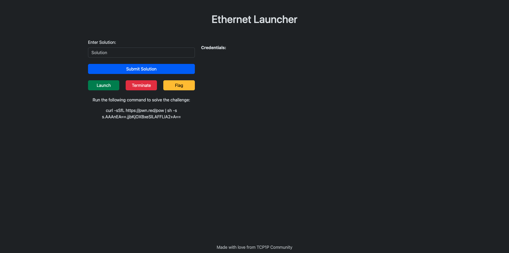
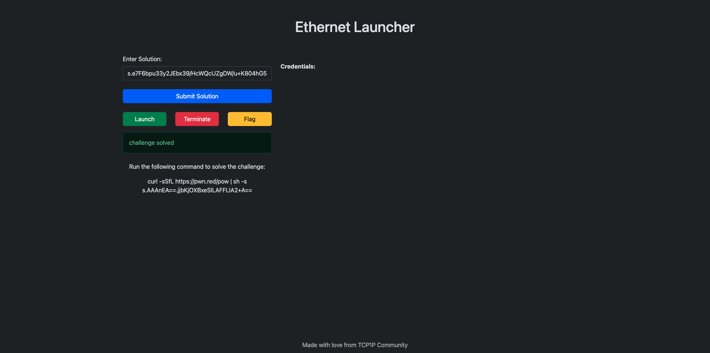
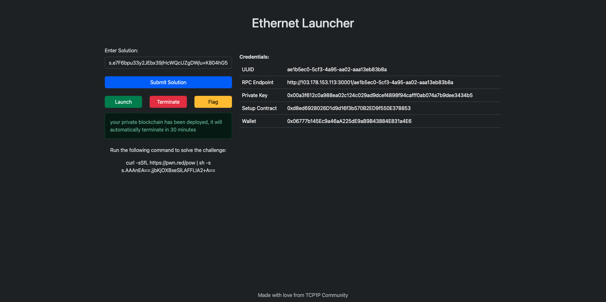
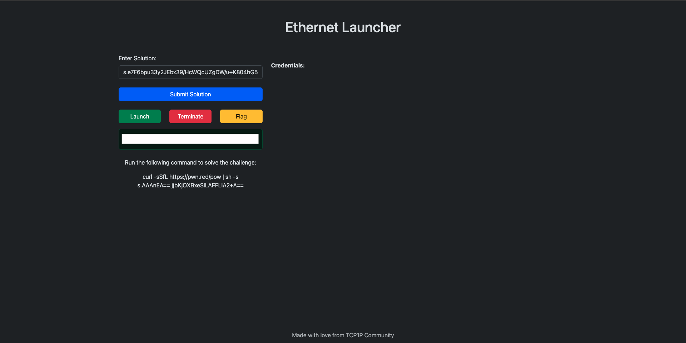

# PLAY 101

Here is a quick guide on how to use the private blockchain infrastructure. You will find "**HERE**" on every "**Hands-On**" box which redirect you to our challenge VPS if you choose to use our official API. If you run the challenge locally, you should get prompted to access the `IP:PORT`, for this example we are going to use briefing, so it's either `127.0.0.1:30001` or `103.178.153.103:30001`.

1. Upon redirection, you will find this **landing page**


2. Next, you need to solve the **Proof-of-Work** first; it's the `curl` command below `"Run the following command to solve the challenge:"`, in this example it's

```bash
$ curl -sSfL https://pwn.red/pow | sh -s s.AAAnEA==.jjbKjOXBxeSlLAFFLIA2+A==

# result
s.e7F6bpu33y2JEbx39/HcWQcUZgDW/u+K804hG5o3kkVXmLSAKt9oEBo3g0hnNEv8gZJqCmFrcDXRxWYW7uqH0uLXqgc6FLd3FUyI36qhgZXFWNKUvbmvsSTCtyyB5uUOhoQ+Chbe3+Zp2vSMXdbhfBIVIQ6A8dA6uc9izQGSOlN5lHW+Wk+hJncy9IbZjVDLZvAMSB45Sirtg9bhLeNvuw==
```

3. Then paste the result into the box and click `Submit Solution.`



4. Now you can launch a new instance by pressing the `Launch` button. You will get your own `UUID`, `RPC URL`, `Wallet & Private Key', and the `Setup Contract Address`. This connection will last for 30 minutes; if it dies, you can start another one.




5. If you need to restart the private blockchain, all you need to do is press the `Terminate` button, then launch another instance by pressing the `Launch` button.

6. Once you're sure that you've solved the challenge, this can be confirmed by viewing the `Setup.sol::isSolved()` function returns; if it returns `1` then it's true, else it's false. Then you can get the flag by pressing the `Flag` button.

```bash
# EXAMPLE: isSolved() is True
$ cast call -r http://103.178.153.113:30001/ae1b5ec0-5cf3-4a95-aa02-aaa13eb83b8a 0xd8ed6928026D1d9d16f3b570B2ED9f550E378853 "isSolved()"  

0x0000000000000000000000000000000000000000000000000000000000000001
```



7. After getting the flag, you can just submit it in the Casino Heist Hands-On Section. 